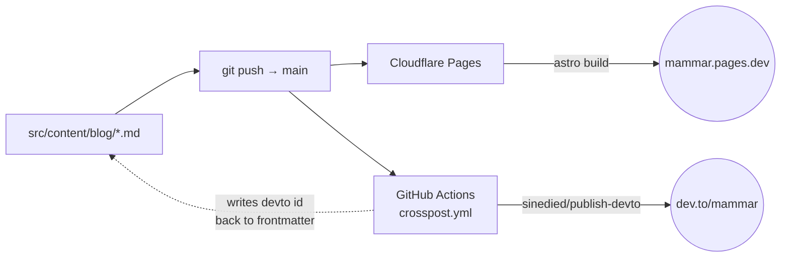

# writeups

Source repository for a personal technical blog. Built with [Astro](https://astro.build), deployed as static HTML to [Cloudflare Pages](https://pages.cloudflare.com), and cross-posted automatically to [dev.to](https://dev.to) for reach.

## Architecture



Source of truth is markdown in `src/content/blog/`. A push to `main` fans out to two parallel pipelines: Astro builds and deploys to Cloudflare Pages, and the GitHub Action cross-posts to dev.to. The dashed line is the cross-post Action committing the dev.to article `id` back so subsequent pushes update the same article instead of creating duplicates.

## Features

What the site does, beyond rendering markdown:

- **Light and dark themes** — CSS-variable design system. Honors `prefers-color-scheme` and lets readers override; choice persists in `localStorage`. No flash on load.
- **Per-post Open Graph images** — auto-generated at build (`/og/<slug>.png`) via [satori](https://github.com/vercel/satori) + [@resvg/resvg-js](https://github.com/yisibl/resvg-js) using bundled Inter. Used for the `og:image` / `twitter:image` cards on dev.to, Twitter, LinkedIn, Slack, etc.
- **JSON-LD** — every post emits `BlogPosting` structured data (`@type`, `author`, `datePublished`, `mainEntityOfPage`, etc.) for richer search results.
- **Tag archives** — frontmatter `tags` automatically drive `/tags/<slug>/` listing pages plus a `/tags/` index with counts. Tag chips on posts and the blog list are clickable.
- **Reader affordances on post pages**:
  - Sticky table of contents (≥1180px) with active-section highlight; collapses to a `<details>` accordion on smaller viewports.
  - Reader font-size control (S/M/L/XL), persisted.
  - Reading-time estimate (computed at build from word count).
  - Reading-progress bar at the top of the article.
  - Copy-code button on every fenced block.
  - Heading anchor links via `rehype-slug` + `rehype-autolink-headings`.
  - Prev/next post navigation.
- **RSS** at `/rss.xml`, **sitemap** at `/sitemap-index.xml`.

## Layout

| Path | What it is |
|---|---|
| `src/content/blog/` | One markdown file per post |
| `src/content.config.ts` | Frontmatter schema (Zod-validated at build time) |
| `src/pages/` | Page templates: home, `about`, `blog/` index + `[...slug]` post template, `tags/` index + `[tag]` archive, `og/[...slug].png` build-time OG image, `rss.xml.js` feed |
| `src/layouts/`, `src/components/` | Reusable view code (Header, Footer, BaseHead, TableOfContents, BlogPost layout, etc.) |
| `src/styles/global.css` | Design tokens (colors, spacing, type scale) and prose styles |
| `src/consts.ts` | Site title, description, author name + URL, social links |
| `astro.config.mjs` | Astro config (site URL, integrations, rehype plugins) |
| `.github/workflows/crosspost.yml` | dev.to cross-post automation |

## Local development

```bash
nvm use                 # picks Node 22 from .nvmrc
npm install             # first time only
npm run dev             # http://localhost:4321
npm run build           # produces ./dist
npm run preview         # serves ./dist locally
```

## Adding a post

Create `src/content/blog/<slug>.md`:

```yaml
---
title: 'Your post title'
description: 'One-line description for SEO and the post listing.'
pubDate: 'May 16 2026'

# optional, Astro-side
updatedDate: 'May 17 2026'
heroImage: '../../assets/your-image.jpg'

# optional, cross-post-side (read by .github/workflows/crosspost.yml)
tags: 'rust, systems, distributed'    # comma-separated, max 4, no '#'
canonical_url: 'https://mammar.pages.dev/blog/your-slug/'
published: true                        # set false to keep the dev.to copy as a draft
---

Post body in markdown.
```

The filename (without `.md`) becomes the URL slug. Each `tags` entry becomes a clickable chip on the post and is also indexed under `/tags/<slug>/` (slug = lowercased, spaces → hyphens). The dev.to / Twitter card image is generated automatically at build from the post's title, date, and tags — no `heroImage` required.

Push to `main` → Cloudflare Pages rebuilds the site → cross-post Action publishes/updates the dev.to copy.

## Deployment

### Primary — Cloudflare Pages

Auto-deploys on every push to `main`. Build settings on Cloudflare:

- Build command: `npm run build`
- Output directory: `dist`
- Node version: `22` (pinned via `.nvmrc`)

### Cross-post — dev.to via GitHub Actions

[`.github/workflows/crosspost.yml`](.github/workflows/crosspost.yml) runs on every push that touches `src/content/blog/**`. It:

1. Skips silently if `DEVTO_TOKEN` is not configured (so the workflow file can land before the secret is in place).
2. Otherwise calls [`sinedied/publish-devto`](https://github.com/sinedied/publish-devto) (pinned to a commit SHA).
3. On first publish of a post, the action writes the dev.to article `id` back into the post's frontmatter and commits it — subsequent pushes update the same dev.to article instead of creating duplicates. Do not edit `id` by hand.

**Setup (one-time):**

1. Generate a dev.to API key at https://dev.to/settings/extensions.
2. In this repo: Settings → Secrets and variables → Actions → New repository secret.
3. Name: `DEVTO_TOKEN`, value: the key from step 1.

Set `canonical_url` in each post's frontmatter so search engines credit the Astro/Cloudflare site (yours) as the original, not dev.to.

Hashnode cross-posting is not currently automated — their GraphQL API moved to paid access. If that changes (or you decide to pay), a parallel workflow can be added.

### Security hardening applied to the workflow

| Hardening | Why |
|---|---|
| `permissions: {}` at workflow level + `contents: write` only on the job | Default-deny; least privilege |
| All third-party and official actions pinned to **commit SHA**, not tags | Prevents tag-retargeting / upstream-repo-compromise attacks |
| [`.github/dependabot.yml`](.github/dependabot.yml) auto-PRs action and npm updates weekly | SHA-pinning doesn't strand us on stale, vulnerable versions |
| `timeout-minutes: 10` on the job | Caps blast radius of any stuck or looping step |
| `concurrency:` group with `cancel-in-progress: false` | Two pushes can't race; in-flight publishes finish before the next runs |
| Secrets injected via `env:` and referenced as quoted shell vars, never inlined | Avoids shell-injection if a secret value ever contains special characters |
| Trigger restricted to `push` on `main` (no `pull_request` from forks) | Untrusted PRs cannot access secrets |

## Branch protection

`main` is protected. Configured via `gh api .../branches/main/protection`; change at [Settings → Branches → main](https://github.com/MohammedEl-sayedAhmed/writeups/settings/branches).

| Rule | Effect |
|---|---|
| **Require a pull request before merging** | No direct pushes to `main`. Approvals required: **0** (single-maintainer; you can merge your own work). |
| **Require status checks: `unit`, `e2e`** | The Vitest and Playwright jobs from `.github/workflows/test.yml` must pass before merge. |
| **Require branches to be up to date** | A PR must be rebased on the latest `main` before its checks count. |
| **Require linear history** | No merge commits on `main` — matches our squash-merge workflow. |
| **Block force pushes** | History cannot be rewritten. |
| **Block branch deletions** | `main` cannot be deleted. |
| **Admin bypass: enabled** | The maintainer can override in genuine emergencies (do not use casually). |

`.github/CODEOWNERS` maps every path to `@MohammedEl-sayedAhmed`. With a single maintainer this is a no-op; if a collaborator joins later, GitHub will automatically request review from the owner on any PR touching covered paths.

## Notes

- `pubDate` is the original publication date; don't change it once a post is live or RSS readers will re-fetch.
- Add `updatedDate` to signal an edit.
- GitHub Actions on public repos are free with no monthly minute cap.
